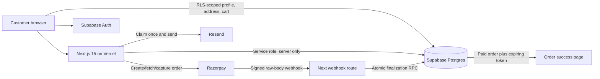

# Divine Mee Complete Website Audit

Audit date: 11 July 2026  
Expected domain: `https://divinemee.com`  
Effective canonical domain: `https://www.divinemee.com`  
Audit branch: `codex/full-prelaunch-audit`  
Remote baseline: `4fa3b7e2880f7d2819e244a831a5bd05d9e92503`  
Preview: `https://divinemee-n6514fd8s-saicharankatragadda-8798s-projects.vercel.app`  
Preview checklist: `https://divinemee-n6514fd8s-saicharankatragadda-8798s-projects.vercel.app/audit-status`

## 1. Executive Summary

The repository builds successfully and the customer-facing flow, cart, account guards, India-only checkout validation, SEO, security headers, and payment trust boundaries have been materially hardened. The optimized build passes lint, strict TypeScript, 52 unit/security tests, 30 functional Playwright cases across Chromium, WebKit, tablet and two mobile sizes, and an all-severity Axe scan.

Launch is **not approved**. Production currently lacks the server credentials required to execute checkout, and no isolated Preview Supabase project exists to run destructive-safe two-user RLS, authentication, migration, payment, webhook or email tests. Google OAuth configuration is not visible to this audit. Required consumer policies/contact details and the requested Rose pouch asset are absent. No real payment or production write was performed.

The requested spelling was checked. `divinemee.com` is correct; `divineme.com` is a different domain and is not referenced. Vercel redirects the apex `divinemee.com` to `www.divinemee.com`, so the effective production origin includes `www`.

## 2. Architecture And Data Flow



Trusted checkout flow:

1. Browser submits only product IDs, quantities, customer details and a UUID idempotency key.
2. Server validates India delivery fields and recalculates catalog prices, shipping and total.
3. Server creates a durable checkout session before creating/recovering a Razorpay order.
4. Browser payment callback is accepted only after HMAC verification and authoritative Razorpay fetch/capture.
5. A `SECURITY DEFINER` RPC atomically creates one order, its items and its payment record.
6. A signed webhook independently reconciles missed callbacks; event ID and database uniqueness prevent duplicates.
7. The cart clears only after verified finalization. Failed/cancelled checkout retains it.

## 3. Commit And Preview Audited

- `git fetch --all --prune` completed before changes.
- Local `main` and `origin/main` matched at `4fa3b7e2880f7d2819e244a831a5bd05d9e92503`.
- Work was isolated on `codex/full-prelaunch-audit`; no force-push, merge, main push or production deployment occurred.
- Vercel Preview deployment completed successfully and returned HTTP 200 through Vercel's authenticated bypass.
- Preview deployment is protected by Vercel Authentication and marked `noindex`.
- Production tests were read-only. No production row was created, changed or deleted.

## 4. Complete Inventory

### Website Routes

| Route | Purpose | Result |
|---|---|---|
| `/` | Animated storefront and product entry points | Tested and passed |
| `/products/rose-magic` | Rose Epsom Salt product detail | Tested and passed |
| `/products/lavender-bliss` | Lavender Epsom Salt product detail | Tested and passed |
| `/checkout` | Guest/signed-in India checkout | Failed, fixed and passed |
| `/login` | Email/password and Google sign-in | Implementation passed; provider execution blocked |
| `/register` | Email/password and Google registration | Implementation passed; provider execution blocked |
| `/forgot-password` | Password-reset request | Implementation audited; email execution blocked |
| `/reset-password` | Recovery-session password update | Implementation audited; recovery execution blocked |
| `/auth/callback` | PKCE code exchange and safe redirect | Static/API audited; external execution blocked |
| `/account` | Protected account overview | Unauthenticated redirect passed |
| `/account/profile` | Protected profile editor | Unauthenticated redirect passed; authenticated write blocked |
| `/account/addresses` | Protected address CRUD/default | Static validation fixed; authenticated write blocked |
| `/account/orders` | Protected customer order history | Unauthenticated redirect passed; populated state blocked |
| `/admin` | Admin-only order/customer overview | Unauthenticated redirect passed; admin state blocked |
| `/order/success` | Paid order lookup by expiring token | Fabricated token 404 passed; paid state blocked |
| `/robots.txt` | Crawler policy | Passed |
| `/sitemap.xml` | Canonical route sitemap | Passed |
| `/audit-status` | Preview-only audit checklist | Preview HTTP 200; production-only guard audited |
| unknown route | Next.js 404 | Passed |

### API Endpoints

| Endpoint | Method | Controls | Result |
|---|---|---|---|
| `/api/razorpay/create-order` | POST | Same-origin, Zod, India-only address, trusted catalog, IP HMAC rate limit, idempotency | Static/unit/API rejection passed; Test Mode execution blocked |
| `/api/razorpay/verify-payment` | POST | Same-origin, strict IDs/signature, HMAC, ownership, authoritative order/payment/amount/currency | Static/unit/API rejection passed; Test Mode execution blocked |
| `/api/razorpay/webhook` | POST | Raw body HMAC, event ID, authoritative fetch, amount/order/session checks, atomic RPC | Static/unit/API rejection passed; signed delivery blocked |
| `/auth/callback` | GET | PKCE exchange, local-only `next`, configured app origin | Static and unsafe-redirect tests passed; OAuth execution blocked |

### Forms

Login, registration, forgot password, reset password, checkout, profile edit, address add and address edit were inventoried. Labels/autocomplete and client validation were checked. Checkout was executed in five browser/viewport projects. Authenticated writes remain blocked without Preview Supabase.

### Database Objects

Tables: `profiles`, `addresses`, `products`, `orders`, `order_items`, `wishlist`, `cart_items`, `payments`, `checkout_sessions`, `payment_webhook_events`.

Triggers: `on_auth_user_created`, `profiles_updated_at`, `orders_updated_at`, `protect_profile_admin`, `products_updated_at`, `addresses_updated_at`, `payments_updated_at`, `cart_items_updated_at`, `checkout_sessions_updated_at`, `payment_webhook_events_updated_at`.

Functions: `handle_new_user`, `update_updated_at`, `prevent_profile_privilege_escalation`, `finalize_razorpay_checkout`, `claim_order_confirmation_email`, `claim_checkout_order_creation`, `set_default_address`.

RLS policies:

- Profiles: own SELECT/INSERT/UPDATE; admin escalation protected by trigger.
- Products: public SELECT only.
- Addresses: own SELECT/INSERT/UPDATE/DELETE with ownership checks.
- Cart: own ALL with `USING` and `WITH CHECK`.
- Orders: own SELECT only; server writes with service role.
- Order items: SELECT only through owned order.
- Payments: SELECT only through owned order.
- Wishlist: own ALL with `USING` and `WITH CHECK`.
- Checkout sessions: own SELECT; service-role processing.
- Webhook events: RLS enabled with no customer policy; service-role processing only.

Migrations `001` through `005` were statically reviewed. Migrations `004` and `005` were not applied because no Preview database exists and production mutation was prohibited.

### Environment Variables

Required names: `NEXT_PUBLIC_APP_URL`, `NEXT_PUBLIC_SUPABASE_URL`, `NEXT_PUBLIC_SUPABASE_ANON_KEY`, `SUPABASE_SERVICE_ROLE_KEY`, `RAZORPAY_KEY_ID`, `RAZORPAY_KEY_SECRET`, `RAZORPAY_WEBHOOK_SECRET`, `CHECKOUT_RATE_LIMIT_SECRET`, `RESEND_API_KEY`, `RESEND_FROM_EMAIL`.

Vercel currently lists only the first five except `RAZORPAY_KEY_SECRET`, all scoped only to Production. Preview has no application variables. Values were never printed or recorded.

Third parties: Vercel, Supabase Auth/Postgres, Google OAuth via Supabase, Razorpay, Resend, and an attributed Pixabay audio file.

## 5. Product And Image Verification

Production Supabase returned exactly two public records:

| ID/slug | Visible name | Price | Weight | Primary image | Status |
|---|---|---:|---:|---|---|
| `rose-magic` | Rose Epsom Salt | ₹279 | 400 g | Rose glass jar cutout | Passed |
| `lavender-bliss` | Lavender Epsom Salt | ₹279 | 400 g | Lavender glass jar cutout | Passed |

Code catalog, seed migration, cart, checkout, order calculation, metadata and JSON-LD use the same IDs and ₹279 price. Pouches are not separate products.

Unresolved product issues:

- P1: Rose pouch image is not present, so the required Rose gallery composition cannot be completed.
- P1: Lavender gallery includes a pouch labelled as 500 g while the purchasable product is 400 g. Owner must confirm this is intentional alternate packaging or provide a matching 400 g image.
- P2: MRP ₹499 and discount presentation came from an owner instruction but was not independently substantiated with pricing evidence. Confirm before launch.
- P2: Claims such as “pure essential oils,” “small batches” and “no harsh chemicals” require owner/manufacturer substantiation. Medical-style claims and fabricated reviews were removed.

Repository/deployed searches found no `divineme.com`, temporary Fable/21st.dev links, localhost metadata or extra product records. Marketing slugs retain `rose-magic` and `lavender-bliss`, while customer-visible names clearly state “Epsom Salt.”

## 6. Frontend Page-By-Page Audit

Homepage navigation, mobile menu, search modal, product links, quick-buy, hero finale links, cart drawer, checkout navigation, footer product links, browser refresh/deep links, invalid URL and reduced-motion presentation were exercised. Invisible hero finale layers had intercepted mobile taps; pointer-event behavior was fixed and retested.

The cart modal and search modal now expose dialog semantics, Escape behavior and focus trapping. Mobile overflow was fixed. Guest cart add, duplicate add, increment, decrement, remove, persistence and checkout navigation passed. Multi-tab storage synchronization was implemented. A failed remote cart read no longer risks deleting the server cart.

Checkout now requires an Indian mobile number, one of 36 states/UTs, country `IN`, and a non-zero-leading six-digit PIN. The example `+37126654986`, state `Riga`, country `LV` is rejected in unit, browser and API tests. Arbitrary street/locality text cannot prove physical deliverability; courier/India Post serviceability should be added later.

Customer-visible policy links are absent because no owner-approved policy text exists. This is a launch blocker under the Consumer Protection (E-Commerce) Rules, which call for clear return/refund/exchange, delivery/shipment, payment and grievance information. See the [Department of Consumer Affairs rules](https://consumeraffairs.nic.in/sites/default/files/E%20commerce%20rules_0.pdf).

## 7. Authentication And Google OAuth

Implemented/audited:

- Email/password signup and sign-in calls use Supabase Auth.
- Signup confirmation explicitly returns through `/auth/callback`.
- Login errors are generic to reduce account enumeration.
- Password minimum is eight characters.
- Password reset uses a PKCE callback into `/reset-password`.
- OAuth and email callbacks accept only safe relative post-login destinations.
- Middleware refreshes sessions using Supabase SSR cookies.
- Logout calls Supabase invalidation and reloads the app.
- Protected account/admin pages perform server-side `getUser()` checks.
- Guest and remote carts merge on login.

Not genuinely tested: first/returning Google login, cancel/deny, account linking, recovery email, expiry/reuse, multiple tabs, mobile/incognito and session expiry. Dashboard/provider access and Preview credentials are missing.

Required Google Cloud settings:

- Authorized JavaScript origins: `https://divinemee.com`, `https://www.divinemee.com`, and the active Preview origin when testing.
- Authorized redirect URI: `https://<SUPABASE_PROJECT_REF>.supabase.co/auth/v1/callback`.
- Supabase Auth Site URL: `https://www.divinemee.com`.
- Supabase redirect allow-list: production `/auth/callback` and the exact protected Preview `/auth/callback` during QA.

## 8. Supabase And RLS Results

Anonymous read-only production probes returned no rows from `profiles`, `addresses`, `cart_items`, `orders`, `order_items` and `payments`; the public catalog returned exactly two rows. No customer data was displayed.

Two-user RLS tests were not run because only the production Supabase project was available. This audit did not create production users or mutate production data. Consequently, cross-user SELECT/INSERT/UPDATE/DELETE, authenticated admin behavior, triggers, RPC grants and migrations are **blocked**, not passed.

The service-role client is imported server-side, does not persist sessions and is never hydrated from customer cookies. Worktree/history scans found no committed service-role value.

## 9. Cart, Address And Checkout Results

Validated server-side cart rules:

- Only `rose-magic` and `lavender-bliss` are accepted.
- Quantities must be integers from 1 through 20.
- Empty, fake, zero, negative, decimal, text and over-limit values are rejected.
- Client price/delivery/tax/total fields are ignored; totals are recalculated from the server catalog.
- One jar: ₹279 + ₹49 shipping = ₹328. Two jars: ₹558 with free shipping.

Address validation rejects missing/blank critical fields, invalid email, non-Indian mobile numbers, unsupported states/countries, zero-leading/short/non-numeric PINs and excessive lengths. React escapes rendered customer input. Database migration `005` adds corresponding new-write constraints and country `IN`.

Address snapshot integrity is enforced by storing the validated customer object in `checkout_sessions` and atomically copying it to the paid order. End-to-end database proof is blocked until migrations run in Preview.

## 10. Razorpay And Webhook Results

Passed through static/unit/API rejection tests:

- Secret remains server-side; browser receives only Key ID.
- Server catalog lookup and price calculation.
- Rupee-to-paise conversion and INR checks.
- Checkout HMAC verification with timing-safe comparison.
- Raw webhook-body HMAC verification.
- Event ID deduplication and database uniqueness.
- Checkout/payment/order ownership correlation.
- Authoritative Razorpay order/payment fetch.
- Exact amount/currency/session-note validation.
- Authorized payment capture for expected amount only.
- Duplicate callback/webhook/order prevention via atomic RPC and unique indexes.
- Failed/cancelled payment leaves cart intact.
- Fabricated success URL cannot mark an order paid.

Blocked: actual Test Mode UPI/card/net-banking/wallet payment, failed/interrupted payment, delayed webhook, missed callback reconciliation, rapid real Pay clicks, provider timeout and database failure after payment.

Official references used: [Razorpay integration steps](https://razorpay.com/docs/payments/payment-gateway/web-integration/standard/integration-steps/), [webhook best practices](https://razorpay.com/docs/webhooks/best-practices/), [webhook validation](https://razorpay.com/docs/webhooks/validate-test/), [test cards](https://razorpay.com/docs/payments/payments/test-card-details/?preferred-country=IN), and [test UPI](https://razorpay.com/docs/payments/payments/test-upi-details//?preferred-country=IN).

## 11. Order And Confirmation Token Audit

The confirmation token is a database-generated UUID with a unique index, approximately 122 random bits, and 30-day expiry. The success page is read-only, requires `payment_status = paid`, returns only order number, total, payment status and item summary, and is served no-store with a no-referrer response policy. It cannot update payment/order state.

One checkout session maps to one order; provider order and payment IDs are unique. The finalization function locks the checkout row and creates order, line items, payment and paid status in one transaction. Refresh does not create an order. Email uses an expiring claim so callback/webhook races do not send duplicates.

Residual: the token appears in the URL and therefore in normal hosting request logs. It is not sent to analytics because none is installed, and cross-origin referrers omit the path. Consider a shorter expiry or authenticated order view after launch.

## 12. Security Findings

| Finding | Severity | Status |
|---|---|---|
| Production checkout lacks Razorpay secret/rate-limit/webhook configuration | P0 | Owner action required |
| Payment/database migration not applied or exercised in Preview | P1 | Owner action required |
| Cross-user RLS and OAuth not genuinely executed | P1 | Blocked |
| Required consumer policy/grievance information absent | P1 | Owner action required |
| Rose gallery asset absent; Lavender pouch weight ambiguity | P1 | Owner action required |
| CSP requires `unsafe-inline` for current Next/Razorpay integration | P2 | Residual |
| Two moderate nested PostCSS dependency advisories | P2 | Residual; unsafe downgrade declined |
| Confirmation token remains in URL logs for up to 30 days | P2 | Residual |
| No application-level auth endpoint rate limiter beyond Supabase controls | P2 | Owner/provider monitoring |
| Large original media repository, though initial hero transfer was reduced | P2 | Improvement made; continue optimization |

No exposed secrets, browser service-role key, obvious IDOR in reviewed code, unsafe open redirect, broad CORS, path traversal, SSRF endpoint, raw SQL interpolation, frontend-trusted payment success or public private-page caching was found. No destructive exploit or denial-of-service testing was performed.

## 13. Browser And Mobile Matrix

| Browser/viewport | Functional cases | Accessibility | Result |
|---|---:|---:|---|
| Chromium desktop | 6/6 | 1/1 all-severity Axe | Passed |
| WebKit desktop (Safari engine) | 6/6 | Not separately run | Passed |
| Chromium tablet 768×1024 | 6/6 | Covered by responsive semantics | Passed |
| Chromium mobile 320×568 | 6/6 | Covered by responsive semantics | Passed |
| WebKit iPhone 13 | 6/6 | Covered by responsive semantics | Passed |
| Firefox desktop | 0/6 | Not run | Blocked: Playwright Firefox SWGL framebuffer failure before page creation |

Tests covered homepage rendering, console/page errors, catalog links, horizontal overflow, cart operations, India checkout validation, auth labels/redirects, product structured data, robots/sitemap/404, fabricated success URL, hostile API origin, foreign address API rejection, malformed verification/webhook and reduced motion.

## 14. Accessibility Results

The latest Axe run found zero automated violations on homepage and checkout. Keyboard-oriented fixes include modal/dialog semantics, names, Escape handling, focus traps, visible native cursor, form labels, meaningful button names and reduced-motion fallback. Touch targets used in primary navigation/cart/checkout meet practical mobile sizing.

Automated checks cannot prove all screen-reader output, focus order under every animation state or human color perception. A manual assistive-technology session remains recommended after owner configuration.

## 15. Performance Results

- Final desktop Lighthouse: Performance 99, Accessibility 100, Best Practices 100, SEO 100; simulated LCP 0.99 s, zero blocking time, negligible CLS and about 0.9 MB initial transfer.
- Final mobile Lighthouse: Performance 69, Accessibility 100, Best Practices 100, SEO 100; observed LCP 1.29 s, simulated throttled LCP 5.59 s, 224 ms blocking time and about 0.88 MB transfer. Repeated mobile scores varied from 62–71 because of animation JavaScript/font CPU variance.
- Initial mobile transfer fell from about 5.3 MB to about 0.9 MB by loading only the poster initially, then sparse/intermediate scrub frames on user intent/idle.
- Homepage first-load JavaScript is approximately 276 kB. Original public media remains about 43.6 MB, but it is not all loaded initially.
- Remaining priorities: reduce variable-font payloads, split below-fold animation JavaScript and generate smaller responsive cutouts without reducing label clarity.

## 16. SEO Results

Canonical metadata uses `https://www.divinemee.com`; apex redirects to that origin. Titles, descriptions, Open Graph, Twitter cards, favicon, sitemap, robots, Product JSON-LD, ₹279 offers and primary images are present. Unknown routes return 404. Preview audit page is `noindex, nofollow`; Vercel also adds `X-Robots-Tag: noindex` to protected Preview deployments.

## 17. Dependency And Secret Scan Results

`npm audit` reports zero critical, zero high, two moderate issues. Both originate from PostCSS `<8.5.10` nested in Next 15.5.20. npm proposes Next 9.3.3, an unsafe framework downgrade; it was intentionally not applied. Track a supported Next release that updates the bundled dependency.

Filename-only secret scans of the worktree and every Git revision found no Razorpay keys, Resend keys, Supabase service-role assignments or matching private tokens. `.env.example` contains names/placeholders only. Public Supabase URL and anon key are expected browser values; service role is not bundled.

## 18. Commands Actually Executed

Key commands (some repeated after fixes):

```text
git status
git fetch --all --prune
git rev-parse origin/main
git switch -c codex/full-prelaunch-audit
npm install
npm audit fix
npm audit --json
npm run lint
npm run typecheck
npm test
npm run build
npx playwright install chromium firefox webkit
npx playwright test ...
npx lighthouse http://localhost:3000 ...
npx vercel env ls
npx vercel deploy --yes
npx vercel curl /audit-status --deployment <preview>
rg / git grep filename-only secret scans
read-only HTTP and Supabase REST probes
```

No production migration, write, payment, refund, settlement or customer-data operation was run.

## 19. Detailed Test Register

| ID | Area | Exact test | Status | Severity | Evidence | Fix | Retest | Owner action |
|---|---|---|---|---|---|---|---|---|
| GIT-01 | Git | Remote main equals audited base SHA | Passed | P1 | `4fa3b7e...` | None | Rechecked | None |
| GIT-02 | Git | Isolated branch/no main push | Passed | P1 | Branch status | Created audit branch | Rechecked | Review PR only |
| BLD-01 | Build | Clean dependency install | Passed | P1 | npm exit 0 | Lockfile updated | Repeated | None |
| BLD-02 | Build | ESLint zero warnings | Passed | P1 | npm exit 0 | Added flat config/fixed findings | Repeated | None |
| BLD-03 | Build | Strict TypeScript | Passed | P1 | npm exit 0 | Fixed types | Repeated | None |
| BLD-04 | Build | Next production build | Passed | P1 | 23 routes generated | Fixed middleware/tooling | Repeated | None |
| CAT-01 | Catalog | Exactly two production products | Passed | P1 | Read-only REST: 2 | None | Rechecked | None |
| CAT-02 | Catalog | Names/IDs/₹279/400 g match code/DB | Passed | P1 | Unit + REST | Corrected seed/catalog | 52 tests | Confirm MRP |
| CAT-03 | Images | Jar primary images | Passed | P2 | Asset/visual inspection | Responsive delivery | Browser matrix | None |
| CAT-04 | Images | Rose pouch in Rose gallery | Failed | P1 | Asset absent/TODO | Cannot invent asset | Not retested | Supply image |
| CAT-05 | Images | Lavender pouch weight consistency | Failed | P1 | Gallery says 500 g; SKU 400 g | Cannot infer | Not retested | Confirm/replace |
| UI-01 | Homepage | Render and no console errors | Failed, fixed and passed | P1 | 5 projects | Fixed CSP/hero layers | 5/5 | None |
| UI-02 | Mobile | No horizontal overflow | Failed, fixed and passed | P1 | 320px/iPhone/tablet | CSS overflow fixes | 3/3 | None |
| UI-03 | Motion | Reduced-motion static hero | Passed | P2 | 5 projects | Existing fallback retained | 5/5 | None |
| UI-04 | Modals | Search/cart focus and Escape | Failed, fixed and passed | P2 | Static + browser | Dialog/focus/body lock | Chromium/WebKit | Manual screen reader |
| CART-01 | Cart | Add/increment/decrement/remove | Passed | P1 | Browser matrix | Existing design retained | 5/5 | None |
| CART-02 | Cart | Refresh/cross-tab persistence | Failed, fixed and passed | P2 | Code/browser | Storage listener | Focused test | None |
| CART-03 | Cart | Login merge and remote persistence | Blocked | P1 | No Preview users | Safer merge/write logic | Not run | Configure Preview Supabase |
| CART-04 | Cart | Fake/zero/negative/decimal/text/huge quantity | Passed | P1 | Unit tests | Zod 1–20 integers | 52 tests | None |
| CHK-01 | Checkout | Foreign phone/state/country rejected | Failed, fixed and passed | P1 | Unit/API/5 browsers | India rules/select/DB checks | 31 browser + 52 unit | Apply migration 005 |
| CHK-02 | Checkout | PIN formatting | Failed, fixed and passed | P1 | Unit/browser | Non-zero six-digit rule | Repeated | Add serviceability provider later |
| CHK-03 | Checkout | Modified price/shipping/total ignored | Passed | P0 | Unit/static | Server recalculation | 52 tests | Test with Razorpay Test Mode |
| CHK-04 | Checkout | Duplicate rapid Pay | Blocked | P1 | Provider unavailable | UI ref + DB claim added | Static only | Test Mode execution |
| AUTH-01 | Auth | Unauthenticated account redirect | Passed | P1 | Browser matrix | Child-page guards fixed | 5/5 | None |
| AUTH-02 | Auth | Unsafe post-login redirect | Passed | P1 | Unit/browser | Relative-path validator | Repeated | None |
| AUTH-03 | Auth | Email signup/sign-in/logout/session | Blocked | P1 | No Preview auth writes | Implementation hardened | Not run | Configure Preview Supabase |
| AUTH-04 | Auth | Password reset lifecycle | Blocked | P1 | Email/provider unavailable | Callback implemented | Not run | Configure Auth email |
| AUTH-05 | Auth | Google OAuth lifecycle | Blocked | P1 | Dashboard unavailable | PKCE callback implemented | Not run | Add exact settings above |
| RLS-01 | RLS | Anonymous private-table SELECT | Passed | P1 | Six production tables empty | Existing policies | Read-only recheck | None |
| RLS-02 | RLS | User A cannot read/edit User B | Blocked | P1 | Preview DB absent | Policies reviewed/hardened | Not run | Create User A/B in Preview |
| RLS-03 | RLS | Service role absent from browser/history | Passed | P0 | Bundle/file/history scan | Server-only client | Rechecked | Rotate if independently exposed |
| PAY-01 | Payment | Trusted order/paise/INR | Passed | P0 | Unit/static | Server calculation | 52 tests | Test Mode execution |
| PAY-02 | Payment | Callback HMAC tamper rejection | Passed | P0 | Unit test | Timing-safe HMAC | Repeated | Test Mode execution |
| PAY-03 | Payment | Raw webhook HMAC tamper rejection | Passed | P0 | Unit/API | Raw-body verifier | Repeated | Configure webhook secret |
| PAY-04 | Payment | Ownership/amount/currency/session notes | Passed | P0 | Static/unit | Authoritative fetch/checks | Repeated | Test Mode execution |
| PAY-05 | Payment | Duplicate callback/webhook/order | Passed | P0 | Static/schema | Event IDs, locks, unique indexes | Unit/static | Apply migrations/test concurrency |
| PAY-06 | Payment | Failed/cancelled/interrupted payment | Blocked | P1 | No Test credentials | Cart-clearing behavior fixed | Not run | Execute test matrix |
| PAY-07 | Payment | Delayed webhook/missed callback | Blocked | P1 | No Test webhook | Reconciliation implemented | Not run | Execute signed webhook |
| PAY-08 | Payment | Database failure after capture | Blocked | P1 | Preview DB absent | Durable session/RPC implemented | Not run | Fault-inject Preview only |
| ORD-01 | Order | Fabricated success URL | Passed | P0 | 404 browser/API | Paid+expiry filter | 5/5 | None |
| ORD-02 | Order | Token unpredictability/uniqueness/read-only | Passed | P1 | Schema/static | UUID unique/expiry | Unit/static | Consider shorter expiry |
| ORD-03 | Order | One payment creates one atomic order | Blocked | P0 | Migration not executed | Atomic RPC implemented | Not run | Preview payment test |
| EMAIL-01 | Email | Confirmation exactly once | Blocked | P1 | Resend unavailable | DB claim/escaped template | Static only | Configure verified sender |
| SEC-01 | Security | Worktree/history secret scan | Passed | P0 | Filename-only scan clean | None | Repeated | None |
| SEC-02 | Security | CSP/HSTS/frame/nosniff/referrer/permissions | Failed, fixed and passed | P1 | Preview headers | Added config | Vercel curl | None |
| SEC-03 | Security | Dependency audit | Failed | P2 | 2 moderate, 0 high/critical | Safe audit fix applied | Repeated | Track Next update |
| SEC-04 | Security | XSS rendering/email template | Passed | P1 | React escaping/unit/static | HTML escape in email | Repeated | Add CSP nonces later |
| A11Y-01 | Accessibility | Axe homepage + checkout all severities | Failed, fixed and passed | P2 | Zero violations | Labels/contrast/names | 1/1 | Manual AT session |
| PERF-01 | Performance | Desktop Lighthouse | Passed | P2 | 99/100 measured | Image/header fixes | Repeated | None |
| PERF-02 | Performance | Mobile initial transfer | Failed, fixed and passed | P2 | 5.3 MB to ~0.9 MB | Deferred hero frames/sizes | Repeated | Continue JS/font work |
| SEO-01 | SEO | Canonical/OG/Twitter/JSON-LD/₹279 | Failed, fixed and passed | P2 | Browser/Lighthouse | Added metadata/schema | 5/5 | None |
| SEO-02 | SEO | robots/sitemap/no accidental noindex | Failed, fixed and passed | P1 | HTTP 200/body | Added routes | 5/5 | None |
| LEGAL-01 | Legal | Returns/refunds/shipping/privacy/contact/grievance | Failed | P1 | Pages absent | Not invented | Not run | Supply approved text/details |
| DEP-01 | Vercel | Preview build and checklist | Passed | P1 | Deployment complete/HTTP 200 | Preview route | Vercel curl | None |
| DEP-02 | Vercel | Production env completeness | Failed | P0 | Missing server vars/scopes | `.env.example` updated | Rechecked | Configure dashboard |

## 20. Files And Commits Changed

Changes are confined to integration/security/payment/account/cart/SEO/testing/audit functionality. Existing luxury layout and hero timeline remain; only interaction safety, responsive delivery and unsupported content were changed. The final branch commit and SHA are recorded in Git after this report is finalized.

Major additions: payment webhook and reconciliation migration, India input constraints, request/payment/email helpers, Playwright/Vitest configuration, automated tests, robots/sitemap, Preview audit page and this report.

## 21. Exact Owner Actions Required

1. Create a separate Supabase Preview/Test project. Apply migrations `001`–`005` in order, inspect warnings, then validate all constraints.
2. Add all required variables to Vercel **Preview**, using Supabase Preview values and Razorpay **Test Mode** keys only.
3. Add missing Production variables only after Preview passes: `RAZORPAY_KEY_SECRET`, `RAZORPAY_WEBHOOK_SECRET`, `CHECKOUT_RATE_LIMIT_SECRET`, `RESEND_API_KEY`, `RESEND_FROM_EMAIL`.
4. In Razorpay Test Mode, create webhook URL `<preview>/api/razorpay/webhook`; subscribe to `payment.captured` and `payment.failed`; use a separate random webhook secret.
5. Verify Razorpay Key ID begins with the Test Mode prefix before any audit payment. Never paste secrets into chat/source.
6. Configure Supabase/Google URLs listed in section 7 and provide dashboard access or screenshots for independent verification.
7. Verify `divinemee.com` in Resend, create an `orders@divinemee.com` sender and add Preview credentials.
8. Supply owner/legal-approved shipping, cancellation, return/refund, privacy, terms, contact and grievance-officer details. Do not accept orders before publication.
9. Supply the Rose pouch image and resolve the Lavender 500 g gallery versus 400 g SKU ambiguity.
10. Substantiate MRP/discount and product/manufacturing claims.
11. Run the two-user RLS and full Razorpay Test Mode matrix, then one controlled live payment only after all P0/P1 items pass.

## 22. Safe Live-Payment Test Procedure

1. Complete all Test Mode scenarios first and preserve screenshots/provider event IDs with identifiers redacted.
2. Confirm Preview and Production credentials are different; confirm no Test key is promoted.
3. Deploy the reviewed commit through a normal Vercel promotion/merge after approval.
4. Use a new isolated customer email and a real Indian delivery address owned by the tester.
5. Add one ₹279 product; independently verify expected ₹49 shipping and ₹328 total before opening Razorpay.
6. Pay once using a low-risk business-approved method. Do not double-click, refund or alter dashboard settings during the test.
7. Confirm Razorpay captured amount/currency/order, one database order, one payment, one line item, exact address snapshot, cart clearing, success page and one email.
8. Confirm webhook event processed and callback/webhook did not duplicate order/email.
9. Redact payment/customer identifiers in evidence. If reconciliation fails, stop sales and use the rollback plan; do not retry blindly.

## 23. Production Deployment Checklist

- [ ] All P0/P1 rows resolved and retested in Preview.
- [ ] Migrations backed up, reviewed and applied to Preview, then Production during a maintenance window.
- [ ] Razorpay Test matrix passed; live keys scoped only to Production.
- [ ] Webhook secret configured and signed event verified.
- [ ] Google and email flows passed on production callback URLs.
- [ ] Consumer policies/contact/grievance details published.
- [ ] Product packaging, MRP, claims, images and weights owner-approved.
- [ ] Final `npm run lint`, `typecheck`, `test`, `build`, E2E and dependency scan pass.
- [ ] Preview commit reviewed and merged without force-push.
- [ ] Vercel alias/canonical/headers/robots/sitemap checked after promotion.
- [ ] One controlled live payment completed and reconciled.

## 24. Rollback Plan

1. Stop new checkout by removing/rotating the Production payment secret or placing the storefront in maintenance without deleting orders.
2. In Vercel, promote the last known-good deployment; do not rewrite Git history.
3. Preserve Razorpay events, Vercel logs and affected database rows for reconciliation.
4. Never roll back a data migration destructively. Apply a reviewed forward migration after backup.
5. Reconcile captured payments against checkout sessions/orders manually using redacted IDs; contact customers where required.
6. Retest the failure in Preview, deploy a normal corrective commit, then repeat the controlled payment.

## 25. Post-Launch Monitoring Checklist

- Payment create/verify/webhook 4xx/5xx rates and latency.
- Checkout sessions stuck in `pending`/`failed` and captured payments without orders.
- Duplicate-event and unique-constraint errors.
- Order/email reconciliation and email delivery/bounce status.
- Supabase auth failures, RLS denials and unusual service-role operations.
- Vercel function exceptions, CSP violations and browser console errors.
- Cart abandonment, payment cancellation and mobile conversion.
- Core Web Vitals by device; especially mobile LCP/INP and hero transfer.
- Dependency/security advisories and key rotation schedule.
- Customer complaints, refund timelines, delivery failures and grievance SLA.

NOT READY TO LAUNCH
